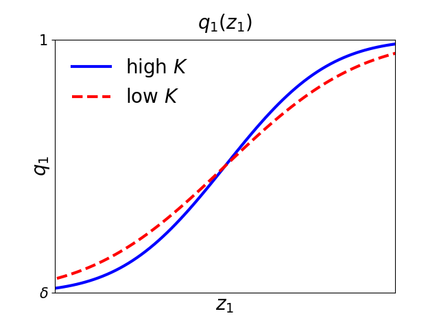
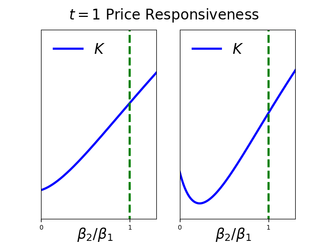
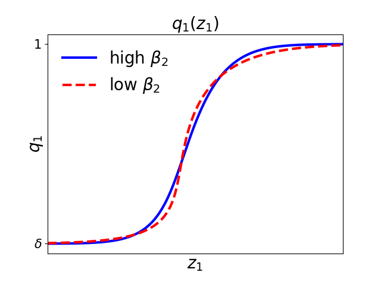

# Figures for Bassetto and Galli (2019)

This code is written in Julia version 1.5.1.

The file `publication-code.jl` makes and saves Figures 1, 2 and 3 from the paper

- Bassetto, Marco, and Carlo Galli. 2019. ["Is Inflation Default? The Role of Information in Debt Crises."](https://www.aeaweb.org/articles?id=10.1257/aer.20170721) American Economic Review, 109 (10): 3556-84.

To run the code
- download this repository in a folder
- open a julia REPL and make sure the working directory is the repo folder
- in the julia REPL, use the command
`include("publication-code.jl")`

### Figure 1

### Figure 2

### Figure 3

